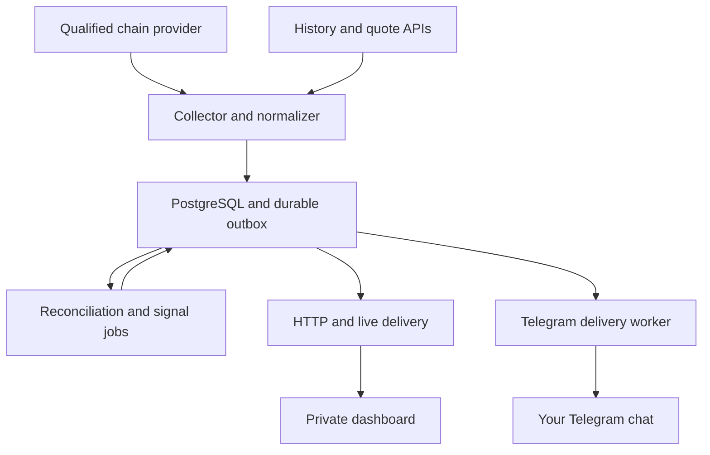

# Wallet Observer — implementation plan

> Historical planning snapshot, retained from the original package. The current [BUILD_PLAN.md](BUILD_PLAN.md) and [website-first decision](docs/decisions/0003-website-first.md) supersede this snapshot, including its mobile-width requirement and publication status. Use those current documents for implementation.

Prepared for **nhattruong0204** on **2 October 2026**.

**Status:** implementation specification and issue drafts. This package does not contain a completed application. GitHub publication is pending repository creation. Proposed repository: `nhattruong0204/wallet-observer`, private, default branch `main`.

## 1. Outcome and scope

Build a personal, read-only monitoring application inspired by Wind's useful wallet/FOMO research workflows. One operator owns one watchlist. Start with a small Solana release, then add the retained personal features only when the necessary data is available.

The desired first-live flow is:

1. Enter a wallet address and alias.
2. Persist supported on-chain activity even while the browser is closed.
3. Show confirmed buys/sells with token, quantity, available valuation, source transaction, and timestamp.
4. Open wallet/token history and filter noise.
5. Receive selected alerts in one Telegram chat.
6. Restart the host and recover supported missing history without duplicate alerts.

A familiar UI is optional. Correct data, readable history, and recoverability matter more than visual similarity.

### Retained personal scope

| Area | First live | Personal expansion |
|---|---|---|
| Watch scope | 10–25 manual Solana wallets, alias, note, groups, pause/remove | 25–100 only when measured demand and cost justify it; verified FOMO identity links |
| Collection | Qualified Solana transaction source | FOMO theses and order metadata; selected additional chains |
| Trade semantics | Supported buys/sells/swaps, confirmation, fees, unknown cases | Observed position ledger, first/add/re-entry, trim/exit; source-backed off-chain states |
| UI | Feed, Watchlist, Settings, wallet/token details, responsive layout | Research/rankings, saved views, pins/ignore, richer personal controls |
| Research | Current quotes, available market fields, collected history, exact search | Local heat, movers, consensus, clan resonance where supported |
| Delivery | One outbound Telegram bot/chat | Existing delivery path reused for additional signals |
| Operations | Private single-host deployment, bounded recovery, backups, status | Broader coverage and more refined usage/retention controls |

### Explicit exclusions

Do not reintroduce:

- X, inbound Telegram channels, Instagram, Truth Social, or Binance Square monitoring.
- pump.fun account/social calls, follow-ups, author discovery, or callout scoreboards.
- ansem.io, Google Easter egg discovery, browser audio, spoken summaries, custom tones, Bark, or wake-up rules.
- Registration, product login/sessions, guest merging, account pairing, subscriptions, billing, quotas, exclusive seats, membership expiration, customer support, or help CMS.
- Trade execution, copy trading, wallet signing, seed/private-key management, or an autonomous trading agent.
- A required AI API call for each transaction.
- Platform-wide FOMO holdings/verification features whose source is unavailable.

A monitored wallet may still trade a token launched on pump.fun. That is chain activity, not the excluded pump.fun social-monitoring product. Likewise, outbound Telegram alerts are retained while inbound Telegram monitoring is excluded.

## 2. Milestones and realistic estimates

| Milestone | Definition | Planning target |
|---|---|---|
| M0: source proven | Environment works; representative source events and a recovery path are verified | First 1–2 focused days if access is immediately available |
| M1: first live | WO-001 through WO-018 complete; small private wallet tracker operates with real data | Approximately 5–10 focused working days with active AI-assisted implementation and review |
| M2: fuller MVP | More complete trade coverage, personal signals, positions, research and hardening | Retain the earlier conservative 20–35 engineer-day scope budget until the source trial is measured |
| M3: expanded personal version | Enabled FOMO capabilities and selected additional chains meet their acceptance gates | Earlier broad planning budget: 40–70 engineer-days under usable-feed assumptions |

These are scope estimates, not measured Astra speed multipliers or completion promises. One focused engineer-day is about six hours. The first-live milestone is intentionally smaller than the fuller MVP. API approval delays, unavailable FOMO access, custom indexer development, and comprehensive historical P&L are not included.

Use the first two days to replace assumptions with measurements. Do not enlarge the chain list or watch universe to meet an arbitrary feature count.

## 3. Architecture

Use a single repository and three runtime services:

| Service | Responsibility |
|---|---|
| API/frontend | FastAPI HTTP/WebSocket; serves built React assets or works behind a small proxy |
| Worker | Provider subscriptions, normalization, reconciliation, recovery, quotes, signals, Telegram |
| PostgreSQL | Durable source records, canonical facts, configuration, jobs, checkpoints, delivery log |

Suggested development baseline: Python 3.12, Node 22, PostgreSQL 16, React/TypeScript, an ordinary frontend build tool, SQLAlchemy/Alembic, and uv. WO-001 must verify supported versions, pin them, and commit lockfiles. These are implementation choices, not Wind's private stack.

No Redis, Kafka, Kubernetes, ClickHouse, dedicated search service, or object-storage media pipeline is required initially.



The source stream runs in the worker, not in the browser. The UI consumes committed facts. Slow quotes and metadata update existing cards as later revisions.

A single-host design accepts a host outage as a collection interruption. Recovery is possible only within the chosen provider's replay/history capabilities, so a gap is reported when complete recovery cannot be established.

## 4. Repository layout to implement

Only planning/backlog files exist in this prepared package. The paths below are targets for the implementation issues.

| Path | Purpose |
|---|---|
| `.devcontainer/` | Reproducible development container and editor configuration |
| `backend/src/wallet_observer/api/` | HTTP routes and response contracts |
| `backend/src/wallet_observer/providers/` | Provider adapters and capability declarations |
| `backend/src/wallet_observer/worker/` | Collector/job entrypoints and orchestration |
| `backend/src/wallet_observer/db/`, `backend/migrations/` | Schema, sessions, migrations and indexes |
| `backend/src/wallet_observer/trades/` | Execution interpretation and reconciliation |
| `backend/src/wallet_observer/recovery/` | Bounded history recovery and coverage gaps |
| `backend/src/wallet_observer/market/` | Token metadata, quotes, freshness |
| `backend/src/wallet_observer/live/` | Committed delivery log and browser catch-up |
| `backend/src/wallet_observer/notifications/` | Telegram outbox/retries |
| `backend/src/wallet_observer/positions/`, `signals/`, `analytics/` | Expanded derived features |
| `frontend/src/` | Typed reusable UI, fixed views and API client |
| `tests/fixtures/`, `tests/unit/`, `tests/integration/`, `tests/e2e/` | Source evidence and meaningful regression tests |
| `docs/` | Contracts, decisions, runbooks, costs and acceptance reports |
| `backlog/` | Detailed issue source material and dependency map |
| `scripts/` | Operator helpers added with the deployment work |

Do not create many empty packages just to resemble this layout. Introduce a module when its issue implements behavior.

## 5. Step 1: establish the devcontainer

Complete **WO-001 before application implementation**.

1. Create `.devcontainer/devcontainer.json`, a development Dockerfile, and `compose.dev.yml`.
2. Use a non-root developer account and a named PostgreSQL volume with a healthcheck.
3. Install pinned Python/Node tooling, Git, and PostgreSQL client tools. Commit dependency locks once dependencies are introduced.
4. Forward only the local API/frontend development ports. Set backend database hostnames correctly for containers.
5. Add Python and TypeScript editor formatting/linting and debugger launch configurations.
6. Keep `.env.example` as placeholders; local secrets and personal watchlists stay untracked.
7. Ensure a clean clone can enter the container and run the documented bootstrap without paid provider credentials.
8. Document Windows/WSL and Linux use. Provider-dependent commands must explain missing configuration.

Target command interface to implement in WO-001/WO-003; these commands are a specification until those tasks land:

```bash
make bootstrap
make dev
make migrate
make lint
make test
make build
make fixtures
```

Live provider probes and Telegram test sends must be opt-in rather than part of every install or CI run.

## 6. Step 2: prove the data source before broad UI work

Start with the Helius Parsed Streams capability as a candidate, because its official documentation describes an outbound decoded Solana WebSocket stream. Qualification must still establish coverage for the routes you actually watch. The source contract, not this document, becomes authoritative for exact endpoint shapes and limits.

Record:

- Authentication and connection limits.
- Supported network, programs and instruction/event types.
- Whether actor, token, raw quantity, route legs, status and slot are present.
- Stable source identifiers and deduplication keys.
- Commitment/finality semantics.
- Replay or bounded history lookup and retention.
- Rate/credit pricing and a measured usage sample.
- Failure, retry, schema-change and outage behavior.

Sanitized fixtures must cover buy, sell, transfer, failed transaction, routed swap, wrapped SOL, duplicate, and unsupported input. Every fixture needs an expected result and provenance. Decoded instructions are not automatically complete economic trades.

If the stream lacks a usable recovery mechanism, prove an independent historical lookup. If neither works, stop expanding the collector and record the gap.

FOMO qualification is separate in WO-023. Wallet mappings, theses, clans and orders may each have different availability. No source must be treated as present merely because a Wind UI control existed.

## 7. Persistence and canonical contracts

### Logical entities

| Entity | Minimum requirements |
|---|---|
| Watches/groups | Chain/address or stable source identity, alias, note, enabled state, membership |
| Account-wallet links | Evidence type/source, verified time, confidence; manual labels kept distinct |
| Raw source events | Provider ID, original payload, occurrence/ingestion time, processing state, retention |
| Canonical events/revisions | Stable event ID, kind, revision, provenance, current display state |
| Executions/legs | Chain, signature/hash, instruction/log identity, attributable actor, assets, quantities, fees, confirmation |
| Tokens/quotes | Chain/address, decimals, name/symbol, observation time/source, stale/missing status |
| Checkpoints/coverage | Safe source boundary, last success, recovery state, known gaps |
| Jobs/outbox | Type, object key, attempt state, lease expiry, next retry, last redacted error |
| Delivery log | Committed ordered position, event ID, revision, payload, expiry/resnapshot behavior |
| Notification outbox | Event/signal and destination identity, attempt state, Telegram message ID |
| Settings | One versioned configuration and browser-local presentation preferences |
| Expanded entities | Positions, signal contributions/rules, theses/mentions, clan snapshots, rollups |

Use exact lookup indexes on chain/address and source-event identity, plus indexed wallet/time and token/time queries. Avoid partitioning until measured retention or query pressure warrants its extra uniqueness/recovery complexity.

Store raw quantities as integers/high-precision numeric and money/prices as decimals. API JSON values that require exact precision are strings, not lossy floats.

Example event contract:

```json
{
  "event_id": "internal-stable-id",
  "revision": 2,
  "kind": "trade.buy",
  "chain": "solana",
  "wallet_address": "case-preserved-address",
  "token_address": "case-preserved-token",
  "source_event_id": "provider-stable-id",
  "transaction_id": "signature",
  "occurred_at": "2026-10-02T12:00:00Z",
  "ingested_at": "2026-10-02T12:00:02Z",
  "chain_confirmation": "confirmed",
  "order_status": null,
  "raw_quantity": "1000000",
  "token_decimals": 6,
  "execution_usd": null,
  "valuation_status": "unavailable",
  "coverage_status": "partial",
  "replay": false
}
```

The strings above are illustrative placeholders, not real addresses or a valid fixture.

### Transaction and replay invariants

1. Persist source/canonical changes and downstream work transactionally.
2. Advance source checkpoints only after the relevant state is durable.
3. Use idempotent writes for provider retries and overlap backfill.
4. Keep economic executions separate from raw provider records and UI grouping.
5. Publish live updates through a committed delivery boundary.
6. A preallocated sequence is not a safe commit watermark. A single ordered dispatcher should serialize/persist delivery positions after observing committed outbox rows.
7. Replaying history rebuilds facts without replaying all external alerts.
8. Expired replay cursors trigger a bounded resnapshot and an explicit UI state.

## 8. Trade, quote and identity rules

- An incoming transfer is not automatically a buy. Check supported execution legs, attributed actor, debits/credits, fees, wrapped SOL and rent/account effects.
- Two transactions with the same amount and timestamp are not the same order.
- Failed, corrected-away, or source-refunded executions must not contribute to confirmed statistics.
- On-chain confirmation and off-chain order outcome are separate concepts.
- A source order attempt that never became a transaction cannot be inferred from an explorer.
- Preserve case-sensitive Solana addresses and signatures. Scope every token by chain and address.
- Count wallets unless evidence allows multiple wallets to be grouped as one identity.
- First buy means first observed buy unless historical completeness is demonstrated.
- An observed position is not accounting-grade P&L. Missing opening balances, transfers or unsupported routes must reduce confidence/completeness.
- Keep execution valuation, current quotes and thesis-time entry metrics separate.
- Missing values remain null/unknown; stale quotes cannot replace newer observations.
- Local rankings describe the monitored universe. They are not global platform rankings.

For personal signals, define window, event eligibility, minimum participants, amount, direction, cooldown, lateness and stale-alert expiry. Net flow and gross directional flow are separate metrics. Store participants and contributions so corrections are reversible.

## 9. HTTP and live API surface

These are proposed contracts, not copies of Wind's private server.

| Method/path | Purpose |
|---|---|
| `GET /health/live`, `GET /health/ready` | Process health and readiness |
| `GET /api/status` | Source state, lag, coverage, queue/storage/usage summary |
| `GET/POST /api/watches` | List/add watches |
| `PATCH/DELETE /api/watches/{id}` | Edit, pause or remove a watch while retaining history |
| `POST /api/watches/import/preview`, `/apply` | Validate and apply a bulk import |
| `GET/POST /api/groups` | Personal watch groups |
| `GET /api/events` | Filtered history with stable cursor pagination |
| `GET /api/wallets/{chain}/{address}` | Wallet detail and coverage |
| `GET /api/tokens/{chain}/{address}` | Token context, current quote, observed activity |
| `GET /api/search` | Exact chain/address and collected text/alias search |
| `GET/PATCH /api/settings` | Non-secret single-user settings |
| `POST /api/notifications/test` | Explicit one-chat Telegram delivery check |
| `GET /ws` | WebSocket upgrade, committed cursor replay and live revisions |
| Expansion endpoints | Positions, research, signals, FOMO theses and clans when enabled |

Use consistent DTOs and filter semantics across views. Paginated history must specify a snapshot/order policy and handle late events. Do not return backend credentials, unlimited raw payloads, or fabricated identity/quote fields.

## 10. Frontend implementation order

1. Build the fixed application shell with connection, empty and error states.
2. Add watchlist editing and group management.
3. Add trade cards, filters and stable pagination.
4. Add WebSocket reconnect/revision handling without losing reading position.
5. Add wallet/token drill-down and exact search.
6. Add Telegram and source-health status in Settings.
7. After first live, add positions, signals, research and saved views.
8. Enable FOMO/chain-specific controls only when their capability gates pass.

Use original design/assets. At minimum, core flows should work at desktop and roughly 390px mobile width, with keyboard focus and readable loading/stale/unknown states. Do not hide data-quality limitations behind decorative UI.

## 11. Build and issue execution order

There are **28 detailed work items**: 18 first-live issues and 10 expansion issues. See [backlog/INDEX.md](backlog/INDEX.md) and the individual Markdown issue drafts for the complete why/what/how/definition-of-done sections.

The stable IDs (WO-001 etc.) are planning identifiers, not invented GitHub issue numbers. Actual issue numbers must be recorded after publication.

Recommended order:

1. WO-001 environment.
2. WO-002 source qualification and WO-003 application foundation.
3. WO-004 database and WO-015 initial CI gates.
4. WO-005 watchlist, WO-006 collection, WO-007 normalization.
5. WO-008 recovery, WO-009 quotes, WO-010 query API.
6. WO-011 live transport, WO-012 feed UI, WO-013 details.
7. WO-014 Telegram, WO-016 operations/usage, WO-017 deployment.
8. WO-018 real-data first-live acceptance.
9. WO-019 positions, WO-020 signals, WO-021 rankings, WO-022 personal configuration.
10. WO-023 FOMO qualification.
11. WO-024 identity/theses, WO-025 orders, WO-026 clans only for verified capabilities.
12. WO-027 one selected additional chain at a time.
13. WO-028 expanded acceptance, with a written disposition for source-blocked or deferred capabilities.

WO-028 requires ordinary completed foundation/analytics work and a FOMO capability decision. WO-024–WO-027 are conditional prerequisites only for features actually enabled in that release. Keep blocked issues open and labelled/documented as blocked; do not claim they were implemented to close a release checklist.

## 12. How to work with Astra/Codex

Use one bounded issue per implementation branch/PR. Provide the issue body, current files, contracts, and sanitized fixtures rather than repeatedly asking the model to recreate the whole application.

Suggested task prompt:

> Read AGENTS.md, BUILD_PLAN.md, and the selected WO issue. Inspect the existing implementation and its dependencies. Implement only that issue, including the meaningful acceptance checks. Use real documented provider contracts or sanitized fixtures; do not invent working integrations. Update the relevant documentation. Report what changed, what was verified, known gaps, and whether every definition-of-done item passed.

The model can produce implementation, migrations, UI, deployment files and checks. The operator still qualifies credentials/data access, reviews real execution correctness, and decides whether a paid integration is worth enabling.

Do not equate generated code volume with completed features. Close an issue only with recorded evidence. Keep commands in documentation aligned with actual files.

## 13. CI and acceptance evidence

CI should run without paid credentials, using deterministic fixtures and disposable PostgreSQL. Add checks for:

- Transaction identity and deduplication.
- Transfer-versus-trade interpretation.
- Same-amount distinct executions.
- Failed/corrected execution exclusion.
- Decimal precision and chain/address identity.
- Quote freshness and missingness.
- Replay during concurrent live traffic.
- Checkpoint persistence across a crash.
- Telegram retries, stale expiry and replay suppression.
- Expanded positions/signals with corrections.

Use browser checks for core reading/watchlist/detail flows. Avoid tests that merely duplicate the implementation or require live APIs on every commit.

First-live gate:

1. Required WO-001–WO-017 work passes.
2. Observe at least 24 hours of real collection; extend when too few representative events occur.
3. Compare a documented trade sample with source transactions.
4. Exercise restart, source disconnect, browser reconnect and throttling.
5. Prove a backup restores in an isolated database.
6. Record gaps, actual provider usage and supported routes.
7. Verify private access and no client-visible credentials.
8. Release a tag with an acceptance report and operator guide.

Do not claim a universal latency guarantee from a small sample. Store both occurrence and arrival timestamps and report measured limits.

## 14. Deployment and day-two operations

Use one always-on VPS with private access. A 2-vCPU/4-GB configuration is a pilot candidate to benchmark, not a capacity guarantee. Increase resources only when memory/disk/latency measurements justify it.

Deployment checklist:

1. Provision the selected host through the operator's existing account.
2. Configure private access and keep database ports off the public interface.
3. Put provider and Telegram credentials in server-side secret configuration.
4. Build tagged images and run migrations deliberately.
5. Start API/frontend, worker and database with restart/health policies.
6. Load the small watchlist and verify one real end-to-end event.
7. Enable backups and test restore.
8. Record release version and rollback steps.

Runbook must cover stopped host, depleted hosting balance, expired credentials, provider throttling, source outage, schema drift, full disk, failed migration, quote outage, queue buildup and uncertain Telegram send acknowledgment.

Monitoring and alert delivery are read-only. There is no transaction signing and no bot-controlled wallet capital.

## 15. Budget and spending controls

Budget snapshot checked in the planning conversation on 2 October 2026:

| Item | Trial | Paid-data pilot |
|---|---:|---:|
| Example 2-vCPU/4-GB VPS advertised by LightNode | USD 14.70/month | USD 14.70/month |
| Helius selected plan | Free, 1M monthly credits | Developer, USD 49/month, 10M monthly credits |
| PostgreSQL/application hosting | Included on VPS | Included on VPS |
| Basic token quotes and ordinary personal Telegram delivery | Initially free within relevant limits | Initially free within relevant limits |
| Backup/storage allowance (estimate) | USD 5–10/month | USD 5–10/month |
| Rounded operating budget | USD 20–30/month | USD 70–80/month |

Astra/Codex access is a separate development cost. If an existing subscription and allowance suffice, there may be no incremental model charge. Additional credits/API usage, taxes, region-specific hosting prices, paid FOMO sources, added chains, and large backfills are outside those operating totals.

The watcher needs no runtime LLM. Optional thesis translation or future AI summaries require their own explicit budget and feature configuration.

Implement source usage reporting, bounded history depth, quote batching/TTL, watch limits as local operational settings, and storage retention. These settings reduce demand but do not replace vendor-side budget controls. Reconfirm prices and included capabilities before purchase.

## 16. Public evidence and reference boundary

This is an independent implementation plan. Public Wind inspection did not identify its private backend/database or exact unpublished ranking algorithms. Matching source coverage and behavior requires its own evidence.

Primary references:

- [Wind](https://wind.jokkimon.club/), [guide](https://wind.jokkimon.club/help), [changelog](https://wind.jokkimon.club/changelog)
- [Dev Container specification](https://containers.dev/implementors/json_reference/)
- [FastAPI WebSockets](https://fastapi.tiangolo.com/advanced/websockets/)
- [PostgreSQL numeric types](https://www.postgresql.org/docs/current/datatype-numeric.html)
- [Solana RPC](https://solana.com/docs/rpc)
- [Helius Parsed Streams](https://www.helius.dev/docs/parsed-streams)
- [Helius plan pricing](https://www.helius.dev/docs/billing/plans)
- [DEX Screener API](https://docs.dexscreener.com/api/reference)
- [Telegram Bot API](https://core.telegram.org/bots/api)
- [LightNode advertised VPS plans](https://go.lightnode.com/)
- [OpenAI coding-access pricing](https://learn.chatgpt.com/docs/pricing)

Exact vendor behavior must be checked during the relevant qualification issue. The project should remain usable with unavailable capabilities disabled.

## 17. Publication status

The GitHub connection was verified as `nhattruong0204`. The available plugin can create files/issues in accessible repositories, but does not expose repository creation. No authenticated GitHub CLI or environment token was available.

All 28 issue bodies and the repository documents are prepared. **No repository or GitHub issues have been created by this package yet.** Once a private `wallet-observer` repository exists, publish the files, create the issues, replace stable-ID dependency references with actual issue links, record the mapping, and verify the resulting repository.

This section must be updated after successful publication.
