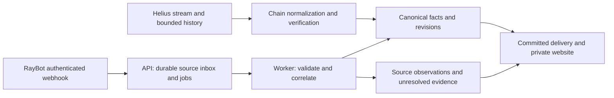

# RayBot integration assessment

Reviewed 2026-10-05. This is documentation-based feasibility and backlog planning,
not a live qualification or an implemented adapter. The owner reports **Pro 200**;
API authentication, available webhook slots and actual delivery behavior have not
been tested. No account, subscription, destination or production setting changed.

## Recommendation

**Proceed with optional qualification and integration alongside Helius.** The best
initial value is importing the existing watchlist and collecting additional source
observations. Keep Helius as the qualified chain verification and bounded recovery
path. RayBot is a candidate corroborating source, not an automatic authority over
execution identity, exact amounts, chain finality or complete position history.
Independence of the two providers' underlying infrastructure is also unverified.

The existing API, worker and PostgreSQL can accommodate this. No extra broker or
service is justified. A custom callback needs public HTTPS; only that authenticated
route should be exposed, with the website and administrative API still private.

This is a proposed extension to the [existing source contract](data-source-contract.md).
Nothing here reverses its partial owner-coverage and recovery limitations. Optional
RayBot work does not become a prerequisite for the first-live website.

## Capability assessment

| Capability                                         | Evidence and practical use                                                                                                      | Decision                                                                    |
| -------------------------------------------------- | ------------------------------------------------------------------------------------------------------------------------------- | --------------------------------------------------------------------------- |
| Wallet-list import                                 | Public wallet-list API plus CSV exports from Destinations; reuse the existing bulk importer and preview alias/status conflicts. | Viable, subject to account or export-format qualification.                  |
| Solana activity webhooks                           | Structured callbacks can enter our durable source inbox and be compared with chain evidence.                                    | Viable secondary input; live semantics gate required.                       |
| Recovery                                           | The reviewed public API documents wallet and webhook management. A web history screen is not a supported history API.           | Retain Helius backfill; RayBot replay availability unresolved.              |
| Metadata and prices                                | Payloads include token data and event-associated valuations.                                                                    | Conditional enrichment with explicit provenance and freshness.              |
| Positions and PnL                                  | Source snapshots can supplement wallet details after unit and coverage checks.                                                  | Separate from our observed ledger; not complete-history proof.              |
| Multi Wallet / Accumulation                        | Webhook documentation names these families; product docs explain configurable rules and CSV signal history.                     | Conditional research comparison; require real payloads and stable identity. |
| FOMO usernames                                     | The Add/Command pages describe beta username resolution.                                                                        | Candidate for existing #23; no public mapping endpoint found.               |
| Wallet search, Related Wallets, KOL feed, rankings | Documented web features, with some public lists.                                                                                | No corresponding public data API found; no private-endpoint scraping.       |
| Token alerts and Unusual Behavior                  | Product features exist, but reviewed callback docs do not establish every delivery schema.                                      | Disabled until separately qualified; do not add speculative adapters.       |
| Other chains, Discord, execution, native mobile    | Provider features are broader than this repository's current scope.                                                             | Existing chain gate #27 and exclusions remain; no new platform work.        |

Sources: [wallet API](https://docs.raybot.app/start/dev/api),
[Destinations/export](https://docs.raybot.app/start/web-app/web/destinations),
[webhooks](https://docs.raybot.app/start/dev/webhooks),
[payload catalogue](https://docs.raybot.app/start/dev/webhooks-api/example-payloads),
[web application](https://docs.raybot.app/start/web-app/web).

## Access and operating constraints

The documented custom-webhook allowance for Pro 200 is **3**. This is a plan
allowance, not evidence of unused slots. The webhook-list API reports `limit` and
`used`; paused/expired destinations have distinct lifecycle states. Discord
webhooks in the pricing table are a different feature.

API credentials come from `/api`; public requests use `api_user` and `token` in
the query string. All control-plane callers need one shared budget below the
documented **5 requests per 10 seconds**, and redaction must include HTTP clients,
proxies, traces and exceptions. Keep credentials and imported personal lists
server-side and untracked. No signing key is required.

The reviewed Pro table lists 200 Solana/Tron wallets, 150 notifications/minute and
20,000/day. Confirm how notification limits apply to custom callbacks instead of
assuming Telegram's transport limits or website claims apply there. No extra
charge or upgrade is authorized by this assessment. Account-specific entitlement
and any incremental cost remain unverified.

Sources: [Webhooks API](https://docs.raybot.app/start/dev/webhooks-api),
[API authentication/budget](https://docs.raybot.app/start/dev/api),
[plan table](https://docs.raybot.app/start/telegram/interface-navigation/upgrade).

## Findings that prevent treating RayBot as canonical truth yet

1. **Delivery identity is inconsistent across pages.** The webhook guide describes
   the delivery header as a transaction signature; the API page shows a UUID.
   Keep transport attempts, transaction identity and payload variants separate.
   A transaction may concern several wallets or executions. Neither field alone
   establishes the instruction identity required by our schema.
2. **Timeouts differ.** The guide specifies a one-second response deadline; API
   creation verification describes five seconds. Design durable acknowledgement
   for the stricter limit and measure actual behavior. The guide documents retries
   for network/5xx failures, no retries for 4xx and automatic pause after repeated
   failures. Retry duration, ordering and replay retention still need verification.
3. **The feed is filtered.** Global and wallet settings, first-only modes, signal
   suppression, burst summaries, expiry and throttling can hide individual events.
   Record effective filters and coverage. A quiet callback is not complete history.
   The settings page describes grouping trades after the first three alerts;
   whether that changes a specific webhook's shape must be tested.
4. **Provider examples expose amount hazards.** The Solana buy example separates
   fee-inclusive wallet debit from curve input. Native SOL appears under a wrapped
   SOL mint. The EVM buy example's `token_changes.amount_raw` differs from the
   lower-level event's raw output despite matching rounded display quantity.
   Exact JSON decoding cannot recover precision already lost upstream. Compare
   verified owner flows; never silently repair contradictions or infer a trade
   solely from incoming tokens.
5. **Positions are observations with limited history.** Example pages describe
   native-currency values; the FAQ also describes a USD display option. The EVM
   sell example explicitly lacks opening buys and has null basis. Require explicit
   units, wallet/token association, signed values, fee basis and coverage. Missing
   basis must not become zero-cost inventory or complete lifetime PnL.
6. **Finality and provenance need qualification.** `failed: false` does not establish
   commitment/finalization. The examples omit canonical instruction indices and
   slots. The meaning of token `created`, event time and quote time needs evidence;
   source receipt time must not substitute silently. Quarantine unsupported cases.
7. **Aggregate semantics differ from local consensus.** Accumulation can group by
   tag or bot; Multi Wallet uses configurable pools and holding rules. A tag is
   not proof of common ownership. A signal is not another execution. ATH-based
   potential gain in exported history is hindsight, not realized performance.

Sources: [delivery guide](https://docs.raybot.app/start/dev/webhooks),
[callback API](https://docs.raybot.app/start/dev/webhooks-api),
[settings and burst behavior](https://docs.raybot.app/start/telegram/interface-navigation/settings),
[Solana buy](https://docs.raybot.app/start/dev/webhooks-api/example-payloads/solana-buy),
[EVM buy](https://docs.raybot.app/start/dev/webhooks-api/example-payloads/evm-buy),
[EVM sell](https://docs.raybot.app/start/dev/webhooks-api/example-payloads/evm-sell),
[FAQ currency setting](https://docs.raybot.app/start/help-and-support/faq),
[Multi Wallet](https://docs.raybot.app/start/telegram/interface-navigation/signals/multi-wallet),
[Accumulation](https://docs.raybot.app/start/telegram/interface-navigation/signals/accumulation).

## FOMO and excluded routes

RayBot's [Add documentation](https://docs.raybot.app/start/telegram/interface-navigation/add)
now describes `/add @username` and `/fomo` as beta mapping features. This is worth
evaluating in [#23](https://github.com/nhattruong0204/wallet-observer/issues/23), but
the reviewed public API does not document username lookup, stable FOMO IDs or
mapping export. A wallet alias containing a username is insufficient identity
evidence. The older manual balance-matching guide is not verification proof.
Theses, clans and off-chain order states remain separately blocked.

Use approved structured APIs or operator-provided exports. Do not ingest Telegram
channels, automate a personal Telegram session, scrape authenticated private web
endpoints or copy trading/Bloom integrations. Discovery lists do not authorize
expanding the personal watch universe automatically. Social links in token metadata
do not authorize social monitoring. Native mobile and installable PWA stay deferred.

## Implementation order and qualification gate

The new WO-029–WO-034 items are optional work, linked through the
[backlog index](../backlog/INDEX.md). Start with capability qualification. A verified
CSV format can proceed independently of live webhook availability; successful API
authentication does not qualify prices, positions or signals automatically.

Then import selected watches, add durable callbacks, reconcile with canonical
executions, and finally add qualified context and research views after the existing
position/signal foundations. Preserve the first-live critical path. Do not replace
the existing collector, position or consensus issues with duplicate implementations.

A future opted-in trial should use a dedicated temporary destination, at most three
existing watched wallets, ten minutes, 100 accepted events and 30 control requests.
These are proposed client bounds, not a provider spending cap. Stop on auth/budget
failures, sanitize real captures and record unresolved behavior. No live provider
request was made during this documentation review.

## Review coverage

All **76 pages** in the official documentation index were retrieved successfully.
The review covered the welcome/changelog, setup, use cases, Telegram and Discord
features, website sections, developer APIs, all ten event-example pages, and support.
API/payload/operating contracts received detailed review; product walkthroughs were
screened for supported exports, integration surfaces and exclusions. Embedded videos
and screenshots were not executed as acceptance tests. Public sample payloads are
vendor-sanitized examples, not observations captured with this account.

The [review inventory](raybot-documentation-inventory.md) lists every page and its
retrieval hash. Only references and our assessment are committed, not a mirror of
the vendor documentation. Accessed documentation can change; qualify against the
actual account before enabling any capability.
